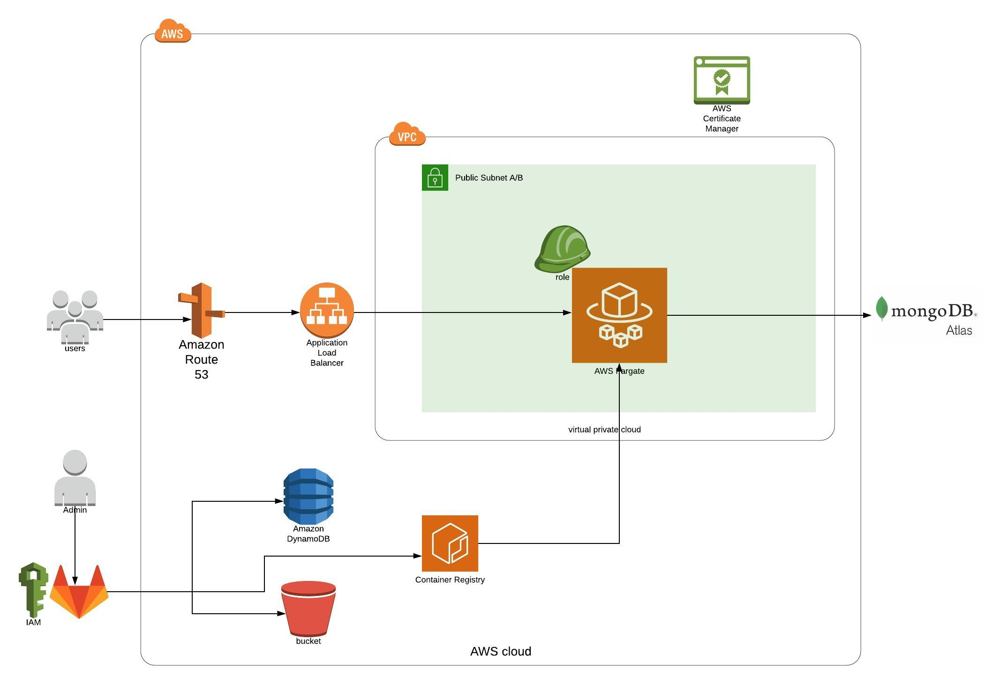

# Ecommerce Project

This project is in progress is only for learning porpourse. I will be improving the application as the times goes by. 

Feel free to fork it if you like. 

Maybe you can find the development version of the app running in this webpage: https://ecommerce.staging.iotcloudsolutions.com/

The idea of this stage of the project is to build a workflow or pipeline using DevOps tools like **Terraform**, **Gitlab** and **Docker**. Let's see how it go...

In the image you can see a simplification of the architecture with AWS.

You can run the applicaton with:
- `npm start`
- docker build and run
- docker-compose up --build  

